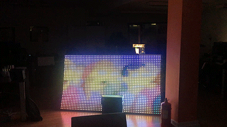
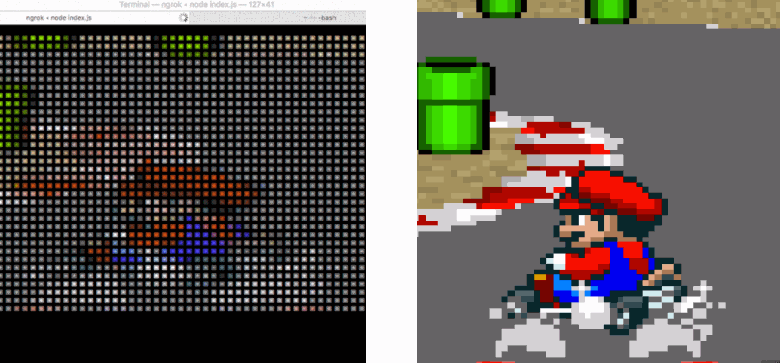

#What is rio?

The main project behind Rio is an interactive, internet connected LED wall. Rio has been used to power a 2 meter x 1.1 meter LED display made by [Solid State Group](https://www.solidstategroup.com). rio-server currently runs here on a Raspberry Pi and drives 2040 pixels with a generic REST and WebSocket API. We also use rio-canvas and rio-mobile to enable new ways to interact with it. 

We were originally inspired by <a href="https://googlecreativelab.github.io/anypixel/">Google Creative Labs's anypixel</a>, however felt that we could create a library ourselves that's a lot easier to build on top of and understand for curious developers who wanted to build something cool.



##1. <a href='./rio-server'>rio-server</a>

This is the main component in the library. It takes different types of data, converts it to rgb arrays and sends it to the LED wall (or any output e.g. terminal). 




At a high level this is broken down into 3 simple concepts:

1. **inputs** -
These files interpret data coming in before frame data is sent to the LED wall.  *e.g. video, gifs, arrays of rgb values, text.*

2. **outputs** -
These files interpret frame data and output them:

- ```console-output``` - Write coloured pixels to terminal.
- ```pi-output``` - Sends data to our lightweight python LED wall firmware.
- ```websocket-output``` - Pixel data is echoed with websockets, meaning you can show a realtime representation of an LED wall on web, mobile, desktop, etc.

3. **clients** -
Integrate with clients that send any form of data, converting them to inputs:
- ```twitter-client``` - Subscribes to twitter stream and displays text on the wall matching #rio.
- ```slack-client``` - Handles messages and passes through as video or gif inputs.
- ```web-client``` - Restful API, request are forwarded onto appropriate input.
- ```websocket-client``` - Accepts raw canvas pixel data and sends directly to outputs.

##2. <a href='./rio-canvas'>rio-canvas</a>


A web app hosting a collection of examples that send pixel data to the rio server.

  *e.g. pong, paint, breakout and more*

You can control rio-canvas from a separate application (e.g rio-mobile) by connecting to it via websockets and sending string messages such as :

 - ```route_pong``` - routing
 - ```'UP', 'DOWN', 'LEFT', 'RIGHT', 'S', 'T', 'C', 'X'``` Player 1 controller
 - ```'UP2', 'DOWN2', 'LEFT2', 'RIGHT2', 'S2', 'T2', 'C2', 'X2'``` Player 2 controller


##3. <a href='./rio-mobile'>rio-mobile</a>
An iOS/Android app built in <a href='https://facebook.github.io/react-native/'>React Native</a> that demonstrates both reading and writing to rio-server.


#Installation
Project specific documentation can be found within each of the application directories above. A few high level notes here to keep in mind:

- <a href='./rio-server'>rio-server</a> can run independently; simply go through the installation instructions there and simulate the LED wall in your terminal within minutes.

- <a href='./rio-canvase'>rio-canvas</a> Requires you to be running **rio-server** and have a valid websocket address defined in its ```config.js```

-  <a href='./rio-mobile'>rio-mobile</a> Requires you to be running both **rio-server** and **rio-canvas** have a valid api/websocket address defined in its ```config.js```

**Prerequesite (make sure these are installed and linked)**

OS | Command
----- | -----
OS X | `brew install pkg-config cairo pango libpng jpeg giflib`
Ubuntu | `sudo apt-get install libcairo2-dev libjpeg8-dev libpango1.0-dev libgif-dev build-essential g++`
Fedora | `sudo yum install cairo cairo-devel cairomm-devel libjpeg-turbo-devel pango pango-devel pangomm pangomm-devel giflib-devel`
Solaris | `pkgin install cairo pango pkg-config xproto renderproto kbproto xextproto`
Windows | [Instructions on our wiki](https://github.com/Automattic/node-canvas/wiki/Installation---Windows)

**El Capitan users:** If you have recently updated to El Capitan and are experiencing trouble when compiling, run the following command: `xcode-select --install`. Read more about the problem [on Stack Overflow](http://stackoverflow.com/a/32929012/148072).

```
cd ./rio-server && npm i
```

```
cd ./rio-canvas && npm i
```

```
cd ./rio-mobile && npm i
```

# Running

```
npm run server
```

```
npm run canvas
```

```
npm run ios
```

```
npm run android
```

# Hardware spec
<a href="./hardware/">If you're looking to make a big LED wall like we did, here's how we did it</a>

# What are you using this for?
We're curious to see how people are using this library. Submit an issue letting us know and we'll show it off here.

# Contribute
We welcome new features / bug fixes, feel free to submit a PR or add an issue with your suggestions. Even if the integrations are pretty out there (biosensors, big data, image recognition) we're willing to give it a go and help out.

For more information about contributing PRs, please see our <a href="CONTRIBUTING.md">Contribution Guidelines</a>.

# Getting Help
If you encounter a bug or feature request we would like to hear about it. Before you submit an issue please search existing issues in order to prevent duplicates. 

# Get in touch
If you have any questions about our projects you can email <a href="mailto:projects@solidstategroup.com">projects@solidstategroup.com</a>.
